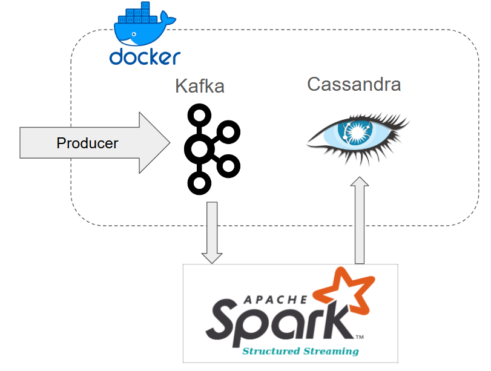

# Spark Structured Streaming - Arbitrary Stateful Processing 



This project implements a Spark Structured Streaming application that processes real-time transaction data for users and computes the number of transactions within the last 5 minutes. The results are stored in a Cassandra database for further analysis, such as using a machine learning model to detect suspicious activity based on transaction counts.

## Overview

The application reads transaction data from a Kafka topic, maintains state for each user, and counts transactions that occurred within the last 5 minutes of the transaction time. The state is updated as new transactions arrive, and the result is periodically saved to a Cassandra table.

### Key Features
- **Real-Time Processing:** Processes user transaction data in real-time using Spark Structured Streaming.
- **Stateful Processing:** Maintains state for each user to keep track of transaction counts within the last 5 minutes.
- **Timeout Mechanism:** Automatically updates transaction counts when no new transactions are received for a user within a specified timeout period.
- **Cassandra Integration:** Stores the transaction counts in a Cassandra database for further analysis.

## Application Flow

1. **Data Ingestion:**
    - Transaction data is read from a Kafka topic (`user-transaction-topic`).
    - Each Kafka message is parsed into a structured format using a predefined schema.

2. **State Management:**
    - The application maintains a state for each user using Spark's `flatMapGroupsWithState` function.
    - It tracks the timestamp of each transaction and counts the number of transactions within the last 5 minutes.

3. **Timeout Handling:**
    - If no new transactions are received for a user within a specified timeout period, the state is automatically updated.
    - The timeout is set to 30 seconds from the latest event timestamp.

4. **Result Storage:**
    - The calculated transaction counts are written to a Cassandra table (`user_transaction_counts` in the `streaming_demo` keyspace).

## Code Structure

- **Main.scala:** Contains the main logic of the application.
    - `InputRow`: Case class representing the input data structure.
    - `PurchaseCountState`: Case class representing the state structure.
    - `PurchaseCount`: Case class representing the output structure.
    - `updateState`: Function to update the state based on new transactions.
    - `addNewRecords` and `removeExpiredRecords`: Helper functions to manage state.

- **Kafka Integration:**
    - Reads data from Kafka using Spark's Kafka connector.
    - Parses JSON messages into a structured format for further processing.

- **Cassandra Integration:**
    - Writes the results to a Cassandra table using the `DataFrameWriterWrapper` API.

## How to Run

1. **Build the Project:**
    - Compile the Scala project using sbt or another build tool.
2. **Start Kafka and Cassandra with Docker:**
    ```bash
   # make sure you're in src/main/docker folder
   $ docker compose up
   
   # enter kafka container bash
   $ docker exec -it broker bash
   # create kafka topic
   $ kafka-topics --create --bootstrap-server localhost:9092 \
    --replication-factor 1 \
    --partitions 1 \
    --topic user-transaction-topic
   # CTRL + D -> exit kafka container bash
   
   # enter Cassandra container cqlsh
   $ docker exec -it cassandra cqlsh
   # create keyspace
   $ CREATE KEYSPACE IF NOT EXISTS streaming_demo WITH REPLICATION = {'class': 'SimpleStrategy', 'replication_factor': 1};
   # create table
   $ CREATE TABLE IF NOT EXISTS streaming_demo.user_transaction_counts ( "userId" TEXT PRIMARY KEY, "purchaseCount" INT, "eventTimestamp" TIMESTAMP, "isTimeout" BOOLEAN );
   ```

3. **Run the Application using IntelliJ:**
    - Run TransactionProducer to start publishing data to Kafka topic
    - Run Main to start stream processing application